# DARL DQN Dummy v1

Notebook autónomo de demostración académica sobre siete signos vitales reales
de PhysioNet y una **etiqueta artificial** de riesgo. Código, supuestos,
comprobaciones y gráficos están en [v1/input/main.ipynb](v1/input/main.ipynb).
La fuente Kaggle es `jeffreyamc/physionet-sepsis-processed`; el notebook no
importa `darl` ni requiere otro dataset.

El replay usa 200 camas durante 16 días simulados. Al acabarse los registros
observados de un paciente, entra otro en la hora siguiente. Son 4.800 registros
por día, 2.400 reservados para evaluar; el resto permite actualizaciones. Las
particiones A y B se hacen por paciente. `SepsisLabel` solo estratifica esas
particiones; XGBoost aprende la etiqueta `y_dummy` creada antes del cambio de
medición. La inferencia usa HR, O2Sat, Temp, SBP, MAP, DBP y Resp.

El DQN recibe tres días de categorías observadas de KS, PSI y AUC, con indicador
de AUC válida. Su red tiene dos capas de 128 neuronas, replay FIFO y target
congelada copiada cada 50 pasos. Elige entre deferir (A1), actualizar features
con mediana/IQR y clipping (A2), reentrenar XGBoost (A3) o ambas etapas (A4).
La recompensa revelada al cerrar el día siguiente es
`AUC_día_siguiente − 0,1 × segundos_de_la_acción`.

Los cuatro escenarios son estable, cambio de medición, cambio de relación
features–etiqueta y ambos cambios. La calibración usa B-train; validación
elige checkpoint; B-test solo mide resultado final. `action_audit.csv` compara
cada decisión DQN con cuatro alternativas evaluadas desde el mismo pipeline;
este oracle es **inmediato**, no una política óptima de largo plazo.

Las figuras en `v1/outputs/figures/` responden a preguntas distintas:

1. `01_ocupacion_recambio`: ¿se sostienen 200 camas y cuántos pacientes entran por día?
2. `02_calendario_cambios`: ¿cuándo comienza cada cambio estadístico?
3. `03_monitoreo_ks_psi_auc`: ¿coinciden alertas KS/PSI con caída o recuperación AUC?
4. `04_entrenamiento_retorno_epsilon`: ¿mejora retorno greedy mientras baja exploración?
5. `05_auc_y_reward_politicas`: ¿mejora DQN AUC y utilidad frente a políticas fijas?
6. `06_acciones_dqn`: ¿cuándo ejecuta cada una de A1–A4?
7. `07_utilidad_acciones_regret`: ¿qué utilidad tenía cada alternativa y cuánto se perdió?
8. `08_saturacion_y_recuperacion`: ¿el clipping explica la diferencia entre actualizar features o solo modelo?

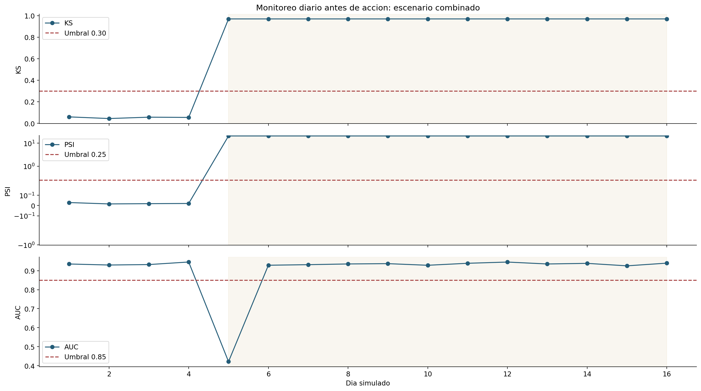

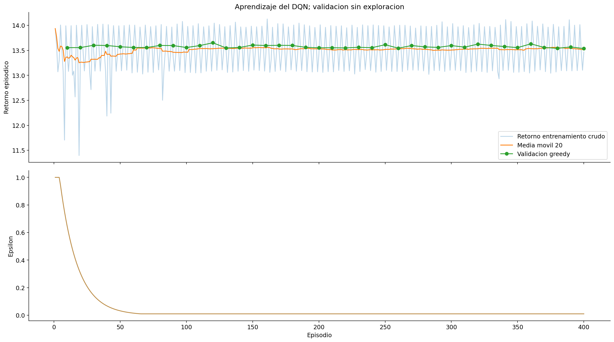

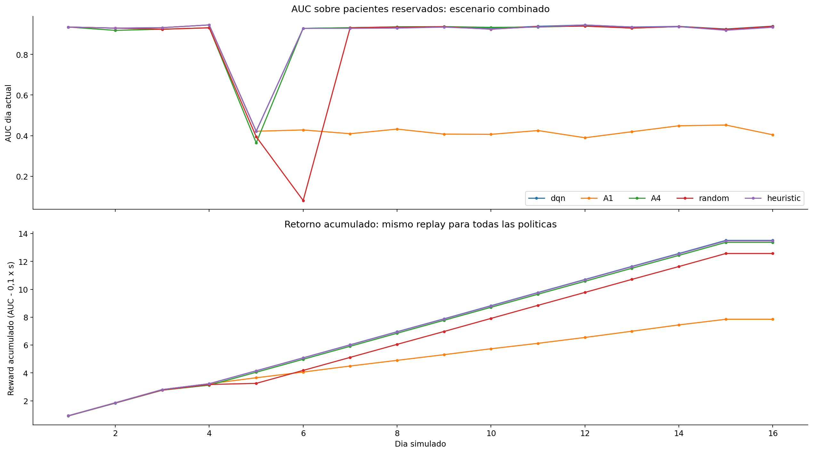

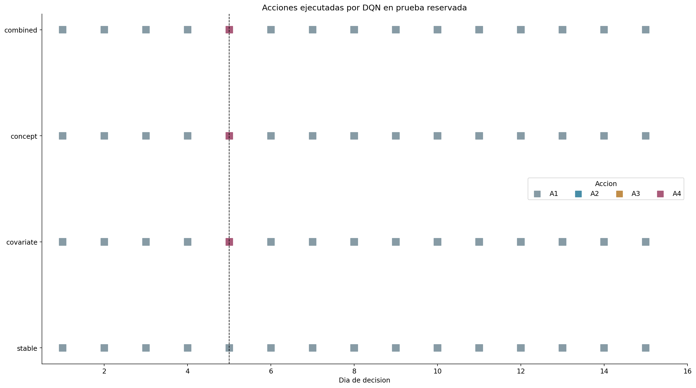

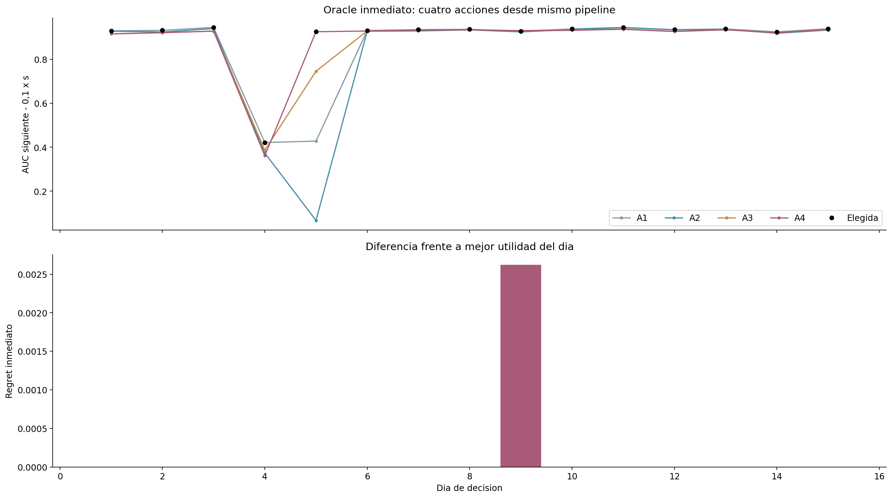

El archivo `run_summary.json` declara cada criterio de éxito como verdadero o
falso. Reward positivo por sí solo es esperable porque AUC es positiva; revisar
**comparación con baselines, regret y estabilidad de validación** antes de afirmar
aprendizaje. Las magnitudes de costo dependen del hardware donde corre Kaggle.

La etiqueta, días, cambios y recambio son construcciones de la demo; ningún AUC
de este experimento representa desempeño clínico.

# DARL DQN Dummy v2

En v1, el DQN eligió A1 en 57 de 60 decisiones. No era un error: el oracle
inmediato también prefería A1 en 52 de 60. Con un único cambio persistente basta
una actualización, y el costo `0,1 × s` (unas 0,003 de AUC) no distinguía A2 y A3
de A4. La versión 2 ([v2/input/main.ipynb](v2/input/main.ipynb), detalle en
[plan/dqn-dummy-v2.md](../../plan/dqn-dummy-v2.md)) cambia solo el entorno:

- **A. Cambio por etapas.** Hay tres etapas desde el día 5, de 4 días cada una.
  La medición se desplaza `k · offset · IQR` en la etapa k. La relación
  features–etiqueta cambia de signo en HR, luego en HR y Resp, y luego solo en
  Resp. En el escenario combinado ambos cambios se alternan. KS/PSI se miden
  respecto al último ajuste de features.
- **C. Costo comparable.** `reward = AUC_día_siguiente − 0,05 · s / mediana_s(A4)`.
  Costos medidos: A2 0,009; A3 0,042; A4 0,050.
- **D. Exploración.** Epsilon decae por episodio (0,985, mínimo 0,05) y seis de
  cada siete episodios de entrenamiento tienen cambio.

Resultado en Kaggle (`jeffreyamc/darl-dqn-dummy-v2`, estado `COMPLETE`, 400 episodios):

| | A1 | A2 | A3 | A4 |
|---|---|---|---|---|
| DQN en prueba (60 decisiones) | 42 | 10 | 7 | 1 |
| Oracle inmediato | 43 | 9 | 5 | 3 |

El DQN coincide con el oracle en el 80% de las decisiones. En los interiores de
régimen, el 92% de sus decisiones queda a ≤0,01 del oracle. Su retorno es mayor
que el de A1, A2, A3, A4 y random en los tres escenarios con cambio. Frente a la
heurística queda empatado en el combinado (12,244 vs 12,241) y por debajo en
concept (13,018 vs 13,132). Se cumplen todos los gates menos `validation_converged`:
la variación de validación es 2,9%, pero la estabilidad de política es 78%, por
debajo del 95% exigido. Por eso `status = needs_improvement`. En concept, el DQN
elige A2 algunos días sin cambio de medición (días 7, 14 y 15); es un error
de política, no un efecto del entorno.

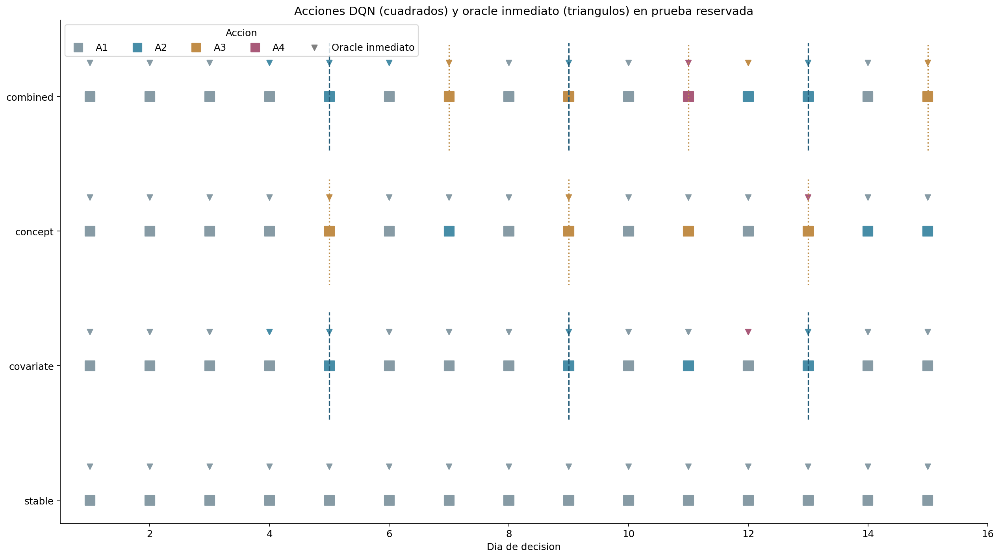

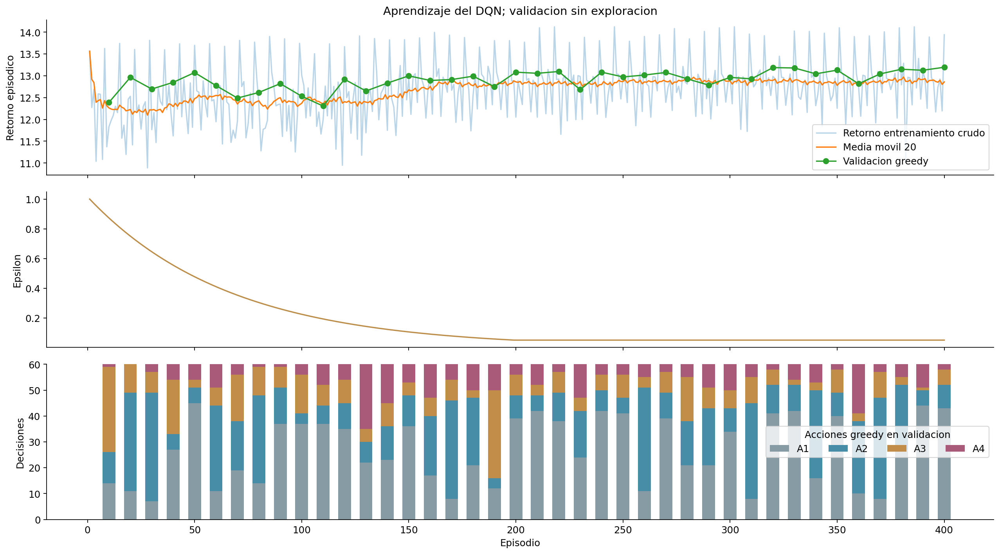

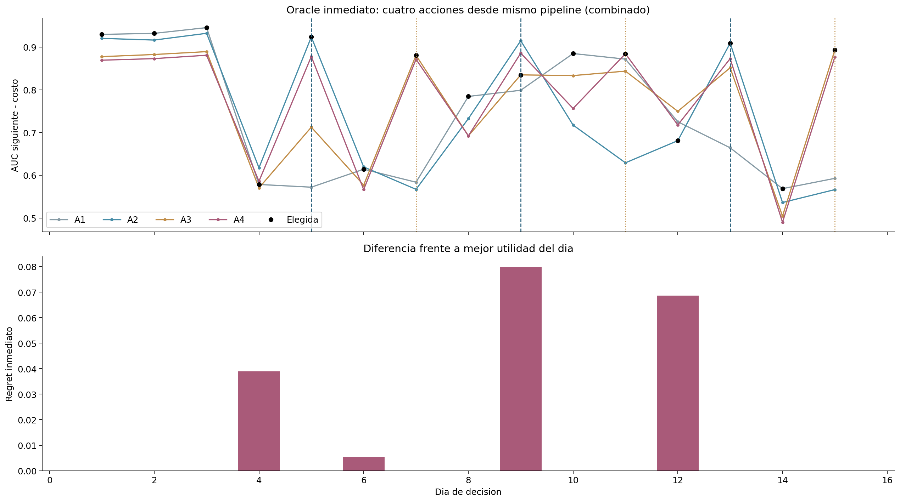

# DARL DQN Dummy v3

Mismo entorno y recompensa que v2. Solo cambia el entrenamiento: 500–1000
episodios, learning rate de 5e-4 a 5e-5, Double DQN, pérdida Huber, epsilon 0,99
por episodio y selección por media móvil de tres validaciones
([plan/dqn-dummy-v3.md](../../plan/dqn-dummy-v3.md)). Kaggle:
`jeffreyamc/darl-dqn-dummy-v3`, estado `COMPLETE`, `status = complete` (todos los
gates cumplidos).

| | v2 | v3 |
|---|---|---|
| Episodios / actualizaciones | 400 / 5.937 | 750 (parada temprana) / 11.187 |
| Checkpoint elegido | 400 | 560 |
| Variación de validación | 2,9% | 0,6% |
| Acuerdo entre últimos checkpoints | 78% | 98% |
| `validation_converged` | ✗ | ✓ |
| Acciones DQN A1/A2/A3/A4 | 42/10/7/1 | 36/16/5/3 |
| Coincidencia con oracle | 80% | 72% |
| ≤0,01 del oracle en interiores | 92% | 92% |
| Retorno covariate / concept / combined | 13,05 / 13,02 / 12,24 | 13,01 / 13,05 / 12,18 |
| Heurística (mismo replay) | 12,98 / 13,13 / 12,24 | 12,99 / 13,13 / 12,24 |

Lectura honesta:

- El gate de convergencia se cumple **solo en el último par de checkpoints**
  (740→750): 1 de 74 comparaciones alcanzó ≥95%, y la parada temprana se activó
  en ese primer cruce. Durante el entrenamiento el acuerdo osciló entre 20% y 90%.
- El gate evalúa los checkpoints 740 y 750, pero la política evaluada en prueba
  es la 560 (seleccionada por media móvil). El criterio heredado de v1 no mide la
  estabilidad del checkpoint desplegado.
- El desempeño en prueba no mejora: las diferencias de retorno (≤0,06) caen
  dentro de lo esperable con una sola semilla. v3 actualiza features con más
  frecuencia de la necesaria (A2 en días interiores), lo que baja la coincidencia
  con el oracle de 80% a 72%.

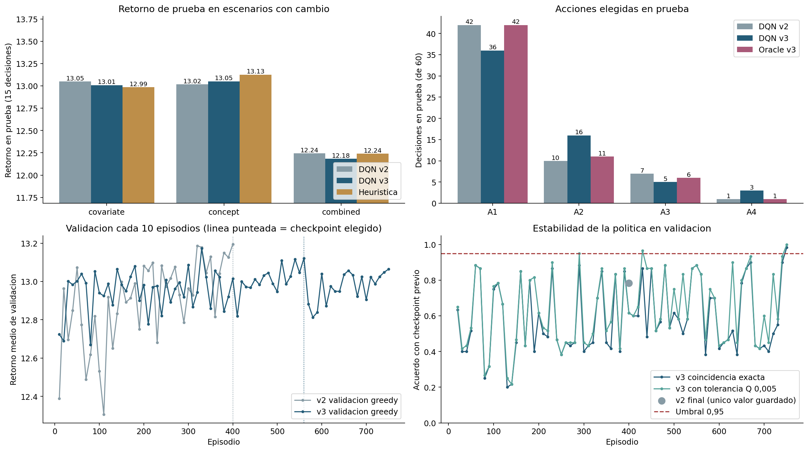

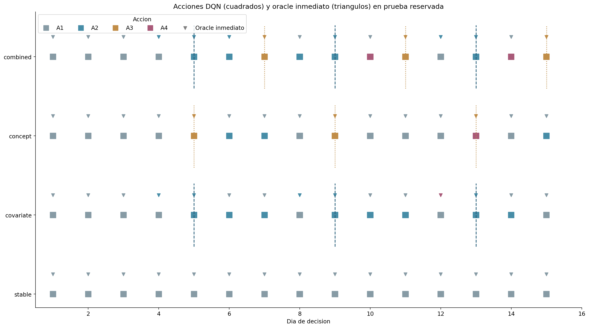

# DARL DQN Dummy v4

Mismo agente, entrenamiento y recompensa que v3 (500–1000 episodios, Adam
5e-4 → 5e-5, gamma 0,99, Double DQN, Huber). Cambia solo la forma del cambio: la
severidad **crece gradualmente cada día** y nunca se detiene
([plan/dqn-dummy-v4.md](../../plan/dqn-dummy-v4.md)). Velocidades calibradas en
B-train: covariate **0,25 IQR/día** y concept **0,15 unidades/día**. Con ellas,
el primer día cae menos de 0,01 de AUC y tras seis días la caída acumulada es de
0,16 y 0,28 sin actuar. Kaggle: `jeffreyamc/darl-dqn-dummy-v4`, estado `COMPLETE`.

| Escenario | DQN | A1 | Mejor acción fija | Heurística | Acciones DQN A1/A2/A3/A4 |
|---|---|---|---|---|---|
| stable | 14,106 | 14,106 | A1 14,106 | 14,106 | 15/0/0/0 |
| covariate | **13,843** | 11,794 | A2 13,776 | 13,807 | 4/11/0/0 |
| concept | 13,382 | 11,369 | A3 13,271 | **13,405** | 13/0/1/1 |
| combined | **13,467** | 11,700 | A4 13,090 | 13,422 | 6/7/0/2 |

AUC media sin actuar frente al DQN: covariate 0,796 → 0,930; concept
0,769 → 0,901; combined 0,790 → 0,910.

Lectura:

- **Covariate:** desde el día 5 el DQN aplica A2 cada día, igual que el oracle
  (15/15). Con deriva continua, reajustar features cuesta 0,009 y recupera más
  de lo que cuesta cada día.
- **Concept:** el DQN espera mientras la AUC baja de 0,94 a 0,81 (días 5–7), actúa
  con A3 el día 8 y con A4 el día 10, y luego vuelve a esperar. El oracle pedía A3
  en los días 6, 7, 9, 14 y 15. La observación codifica la AUC en tres categorías
  (<0,65; 0,65–0,85; ≥0,85), así que el agente solo reacciona al cruzar 0,85; A3
  cuesta 0,042. Por eso actúa tarde y pierde frente a la heurística (−0,02).
- **Gates:** todos se cumplen salvo `validation_converged`. La variación es 1,5%,
  pero el acuerdo entre los dos últimos checkpoints es 85%; el entrenamiento llegó
  a los 1000 episodios sin parada temprana.
- Los retornos de v4 no son comparables con v2/v3 porque el entorno es otro.

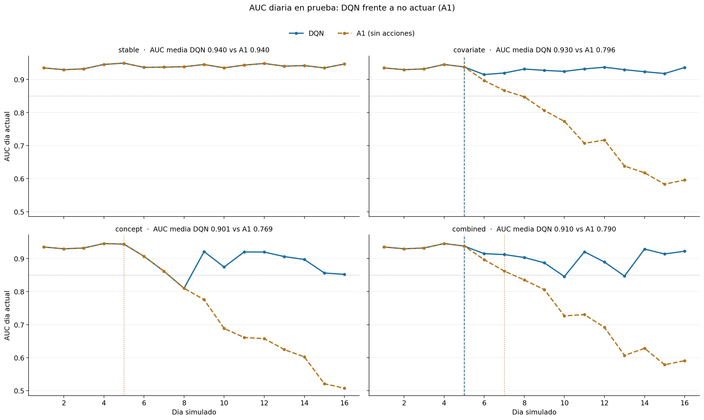

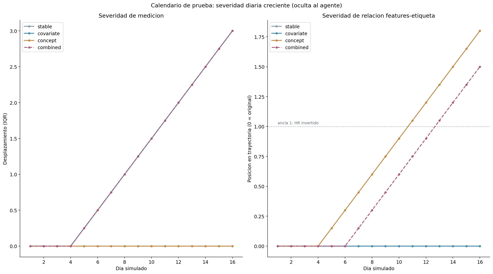
