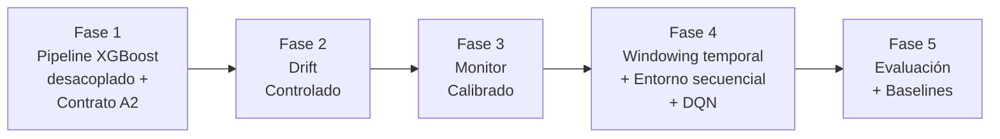

# DARL PoC — Plan de implementación (v2)

Reescritura de la PoC con DQN sobre entorno secuencial real. Incorpora A2 validadas del notebook, estructura temporal de PhysioNet y windowing por cohortes.

---

## Diagnóstico del código actual

### Estructura real

```text
code/src/darl/
├── data/
│   ├── get_dataset.py       # tableshift loader (PhysioNet)
│   ├── preprocessing.py     # prepare_model_frame, select_training_sample
├── drift/
│   ├── __init__.py
│   ├── injector.py           # Beta-mixture covariate + label flip concept
├── monitoring/
│   ├── __init__.py
│   └── drift_metrics.py      # ks_stat, psi_numeric, psi_categorical, js_divergence, hellinger, chi2_test
├── pipeline/
│   ├── __init__.py
│   ├── logreg_stage.py       # Stage1 (QT+Imputer+Scaler) + Stage2 (LogReg) — decoupled
│   ├── xgboost_pipeline.py   # sklearn Pipeline monolítico (no apto para A2 selectivo)
├── actions/
│   ├── __init__.py
│   ├── selective_update.py   # A1, A2, A2c, A3, A4 + eval_metrics + quantile/location-scale maps
├── rl/
│   ├── __init__.py
│   ├── env.py                # DarlUpdateEnv — contextual bandit, no MDP
│   ├── scenarios.py          # make_synthetic_scenarios — info leakage
│   └── training.py           # PPO (SB3) — NO existe DQN
├── evaluation/
│   ├── eval_metrics.py       # VACÍO
│   └── model_metrics.py      # evaluate_auc
├── types/
│   └── types.py              # _NumericMeta, _CatMeta, _LabelMeta
├── utils/
│   ├── __init__.py
│   ├── beta_dist.py
│   └── project.py
└── visualization/
    ├── drift_plots.py
    └── plots.py
```

### Problemas críticos

| Módulo | Sev. | Problema |
|---|---|---|
| `rl/env.py` | 🔴 | No secuencial: steps i.i.d., acción no afecta estado siguiente |
| `rl/scenarios.py` | 🔴 | Info leakage: `has_covariate/concept_signal` ← true drift type |
| `rl/training.py` | 🟡 | Solo PPO (SB3), no existe DQN |
| `drift/injector.py` | 🟡 | Concept drift = solo label flip; sin `selection_strategy` |
| `monitoring/` | 🟡 | Funciones sueltas; sin orquestador, calibración, vector obs, C2ST |
| 4 subpackages | 🟡 | Faltan `__init__.py` en data/, evaluation/, types/, visualization/ |
| `pyproject.toml` | 🟡 | `name="pfc1"`, `requires-python>=3.12`, falta `scipy` |

### Activos reutilizables del notebook `poc_compatibility`

| Componente | Ubicación | Estado |
|---|---|---|
| A2 location-scale normal | `selective_update.py` → `fit/apply_reference_location_scale_map(robust=False)` | ✅ Validado: AUC 0.6718 (recovery 24%) |
| A2 location-scale robust | `selective_update.py` → `fit/apply_reference_location_scale_map(robust=True)` | ✅ **Mejor A2**: AUC 0.6874 (recovery 35%) |
| A2 quantile map | `selective_update.py` → `fit/apply_reference_quantile_map(n_quantiles=501)` | ✅ Validado: AUC 0.6816 (recovery 31%) |
| A1 frozen | `selective_update.py` → `run_a1()` | ✅ Baseline: AUC 0.6380 |
| A3 retrain model | `selective_update.py` → `run_a3()` | ✅ Validado: AUC 0.7385 (recovery 72%) |
| Stage 1 desacoplado | `logreg_stage.py` → `fit_stage1`, `apply_stage1` | ✅ |
| Drift Beta-mixture | `drift/injector.py` | ⚠️ Solo covariate; necesita concept drift real |
| XGBoost monolítico | `xgboost_pipeline.py` → `make_xgb_pipeline` | ⚠️ No apto para A2 selectivo |

### Resultados empíricos del notebook (base para el plan)


| Método | AUC | Recovery % |
|---|---|---|
| Base sin drift | 0.7776 | — |
| A1: Congelado + Beta-drift | 0.6380 | 0% |
| A2: media-desviación (normal) | 0.6718 | 24.2% |
| A2: mediana-IQR (robust) | 0.6874 | **35.4%** |
| A2: mapeo cuantílico | 0.6816 | 31.2% |
| A3: reentrenado post-drift | 0.7385 | **72.0%** |

> Recovery % = (AUC_post − AUC_drift) / (AUC_base − AUC_drift) × 100

**Implicación para DARL**: A2 ofrece recuperación parcial con menor costo. A3 recupera más pero cuesta más. DQN debe aprender cuándo el trade-off AUC/costo favorece cada acción.

---

## PhysioNet: temporalidad y windowing

### Estructura temporal de MIMIC-III / MIMIC-Extract

PhysioNet (MIMIC-III via MIMIC-Extract) tiene estructura temporal rica:

| Campo | Descripción | Uso para DARL |
|---|---|---|
| `admittime` | Timestamp de admisión hospitalaria | **Ordenar pacientes cronológicamente** |
| `intime` / `outtime` | Entrada/salida de ICU | Delimitar ventanas |
| `hours_in` | Horas desde admisión ICU (0, 1, 2, ...) | Series temporales horarias |
| Rango temporal | **2001–2012** (~11 años) | Drift temporal natural |
| Cohorte | ~23,944 estancias ICU únicas | Suficiente para windowing |

### Series temporales vs tabular

MIMIC-Extract produce **series horarias** por estancia ICU:

```text
subject_id | icustay_id | hours_in | HR  | SBP | MAP | Resp | Temp | ... | mort_hosp
1001       | 5001       | 0        | 88  | 120 | 80  | 18   | 36.8 | ... | 0
1001       | 5001       | 1        | 92  | 115 | 78  | 20   | 36.9 | ... | 0
...
```

Para uso **tabular** (que es nuestro caso), se agregan las series por estancia:
- Media de signos vitales en ventana de observación (primeras 24h)
- Min/Max de labs
- Último valor registrado
- Conteo de mediciones (indicador de missingness)

> [!NOTE]
> **TableShift entrega datos pre-agregados** (1 fila por estancia ICU). La temporalidad está en `admittime`, no en `hours_in`.

### Estrategia de windowing para DARL

**Opción propuesta**: Ordenar estancias por `admittime` y crear ventanas cronológicas:

```text
Ventana 0 (referencia):  admisiones 2001-2003   → entrenar pipeline base
Ventana 1:               admisiones 2003-2004   → monitorear, decidir acción
Ventana 2:               admisiones 2004-2005   → monitorear, decidir acción
...
Ventana N:               admisiones 2011-2012   → últimas ventanas
```

**Drift temporal natural**: las prácticas clínicas, protocolos, demographics y tecnología cambiaron entre 2001-2012. Esto produce drift real sin necesidad de inyectar drift sintético para evaluación E2E.

**Drift sintético controlado**: además del drift temporal natural, inyectar drift controlado sobre ventanas específicas para evaluar el inyector y el monitor en condiciones conocidas.

> [!IMPORTANT]
> Para que `admittime` sea usable, hay que verificar si TableShift lo expone. MIMIC-III de-identifica fechas con offset aleatorio **por paciente** (preserva orden relativo dentro de un paciente, pero no entre pacientes). Sin embargo, MIMIC-Extract puede preservar el orden relativo por cohorte si se usa `intime` o un proxy temporal.

### Alternativa si `admittime` no está disponible

Si TableShift no expone timestamps:
1. **Simular temporalidad**: particionar el dataset aleatoriamente en N ventanas secuenciales (como si fueran cohortes temporales)
2. Inyectar drift **progresivo** sobre ventanas sucesivas
3. Documentar que la temporalidad es simulada

Esta alternativa pierde el drift natural pero mantiene la estructura secuencial del experimento.

---

## Viabilidad de cambiar de dataset

### ¿Se puede cambiar de PhysioNet?

Sí, pero con trade-offs:

| Factor | PhysioNet | Otros TableShift datasets |
|---|---|---|
| Temporalidad | ✅ 2001-2012, timestamps reales | ⚠️ Varía (ACS tiene año de encuesta, Heloc no tiene) |
| Tamaño | ✅ ~24K estancias | Varía: 100K+ (ACS) a 10K (German Credit) |
| Drift natural | ✅ Cambios en prácticas clínicas | ⚠️ Depende del dataset |
| Dominio clínico | ✅ Alineado con tesis (ML pipelines en salud) | ⚠️ Menos relevante temáticamente |
| A2 validada | ✅ Notebook ya muestra recovery con XGBoost | ❌ No validado |
| Complejidad features | ✅ Vitals + labs + demographics (mixto) | Varía |

**Recomendación**: Empezar con PhysioNet (ya validado). Si se necesita generalización, agregar un segundo dataset como ACS Income o ANES (ambos con componente temporal en TableShift). Esto queda para **trabajo futuro**, no para la PoC.

---

## Decisiones de diseño actualizadas

### A2: 3 variantes en el espacio de acciones

El notebook valida 3 mecanismos A2. Propongo **no** expandir el espacio de acciones de DQN a 6 (A1, A2a, A2b, A2c, A3, A4), sino mantener 4 acciones discretas con A2 configurable:

**Opción A (recomendada)**: A2 = **mejor variante** (A2b: mediana-IQR, recovery 35.4%). Las otras variantes se evalúan como ablation study.

**Opción B**: A2 = pipeline de selección automática: probar las 3 variantes → elegir la que produce menor divergencia Wasserstein post-corrección.

> [!IMPORTANT]
> **Q6**: ¿Mantener A2 = una sola variante (mediana-IQR, la mejor validada) o implementar selección automática entre las 3? La primera es más simple para DQN; la segunda más robusta.

### Stage 2: XGBoost desacoplado

El notebook usa `make_xgb_pipeline` (monolítico) para el modelo base, pero las acciones A2/A3 operan con LogReg. Para la PoC necesitamos **XGBoost desacoplado** para que A3 reentrene XGBoost, no LogReg.

---

## Fases de implementación



---

## Fase 1 — Pipeline XGBoost desacoplado + contrato A2

### `pipeline/`

#### [NEW] [xgb_stage.py](file:///c:/Users/jeffr/GitHub/tesis-darl/code/src/darl/pipeline/xgb_stage.py)

Stage 2 XGBoost desacoplado, compatible con `fit_stage1` / `apply_stage1` existentes:

```python
class XGBStage2:
    """XGBoost classifier as decoupled Stage 2.

    Compatible con output de fit_stage1/apply_stage1 de logreg_stage.py.
    """
    def __init__(self, n_estimators=200, max_depth=6, learning_rate=0.05, seed=42): ...
    def fit(self, X: np.ndarray, y: np.ndarray) -> "XGBStage2": ...
    def predict_proba(self, X: np.ndarray) -> np.ndarray: ...
    def evaluate(self, X: np.ndarray, y: np.ndarray) -> float: ...  # AUC
    def get_feature_importances(self) -> dict[str, float]: ...
    def save(self, path: str): ...
    def load(self, path: str): ...
```

#### [NEW] [compatibility.py](file:///c:/Users/jeffr/GitHub/tesis-darl/code/src/darl/pipeline/compatibility.py)

Contrato formal. Usa Wasserstein distance entre output de Stage 1 viejo vs nuevo:

```python
@dataclass
class CompatibilityReport:
    is_compatible: bool
    dimension_match: bool
    distribution_divergence: float     # Wasserstein mean
    max_feature_divergence: float
    per_feature_divergence: dict[str, float]
    mismatches: list[str]

def check_stage1_compatibility(
    stage1_old: tuple,     # (qt, imputer, scaler)
    stage1_new: tuple,
    X_sample: pd.DataFrame,
    vitals: list[str],
    numeric_cols: list[str],
    threshold: float = 0.5,
) -> CompatibilityReport:
    """Transforma X_sample con ambos Stage 1, compara distribuciones."""
```

### `actions/`

#### [MODIFY] [selective_update.py](file:///c:/Users/jeffr/GitHub/tesis-darl/code/src/darl/actions/selective_update.py)

Cambios:
- Agregar `run_a2_with_contract()`: ejecuta A2 correctivo (mediana-IQR por default) → verifica compatibilidad → fallback si falla
- Agregar versiones `run_a*_xgb()` usando `XGBStage2` en lugar de LogReg
- Agregar medición RAM con `tracemalloc`
- Los 3 mecanismos A2 ya existen (`fit_reference_location_scale_map`, `fit_reference_quantile_map`); reutilizar

### Infraestructura

#### [NEW] `data/__init__.py`, `evaluation/__init__.py`, `types/__init__.py`, `visualization/__init__.py`

#### [MODIFY] [pyproject.toml](file:///c:/Users/jeffr/GitHub/tesis-darl/pyproject.toml)

- `name = "darl"`
- Agregar `scipy`
- `requires-python = ">=3.10"`

### Verificación Fase 1

```bash
# Pipeline XGBoost desacoplado: fit + evaluate AUC > 0.7 en PhysioNet
# Contrato A2: drift leve → compatible; drift severo → incompatible
python -m pytest code/tests/test_pipeline_xgb.py -v
python -m pytest code/tests/test_compatibility.py -v
```

---

## Fase 2 — Drift controlado

### `drift/`

#### [MODIFY] [injector.py](file:///c:/Users/jeffr/GitHub/tesis-darl/code/src/darl/drift/injector.py)

Extender `DriftInjector.transform()`:

**`selection_strategy`**:
- `"important"`: top-k por `XGBStage2.get_feature_importances()` (solo datos de training)
- `"domain"`: vitals = `["HR", "SBP", "MAP", "Resp", "Temp"]`
- `"random"`: ya implementado
- `"all"`: estrés

**`concept_drift_method`**:
- `"boundary_shift"`: flipear etiquetas de muestras con prob predicha ∈ [0.4, 0.6], con probabilidad ∝ severity
- `"feature_swap"`: permutar valores de features relevantes entre clases
- `"label_flip_control"`: actual (control negativo)

**Bugs a corregir:**
- Computar métricas **después** de aplicar ambos tipos de drift
- No mutar `self._numeric_meta` en `transform()` — usar copias
- `psi_numeric`: quantile binning con bins abiertos en extremos

**3 escenarios:**

```python
SCENARIOS = {
    "localized":  {"feature_fraction": 0.2, "selection_strategy": "important"},
    "control":    {"feature_fraction": 0.2, "selection_strategy": "random"},
    "stress":     {"feature_fraction": 1.0, "selection_strategy": "all"},
}
```

### Verificación Fase 2

```bash
# PSI > 0 solo en features seleccionadas para "localized"
# boundary_shift degrada AUC > label_flip para misma severity
python -m pytest code/tests/test_drift_injector.py -v
```

---

## Fase 3 — Monitor calibrado

### `monitoring/`

#### [MODIFY] [drift_metrics.py](file:///c:/Users/jeffr/GitHub/tesis-darl/code/src/darl/monitoring/drift_metrics.py)

Corregir `psi_numeric`: quantile binning, bins abiertos en extremos.

#### [NEW] [c2st.py](file:///c:/Users/jeffr/GitHub/tesis-darl/code/src/darl/monitoring/c2st.py)

`LogisticRegression` AUC para distinguir referencia vs actual.

#### [NEW] [monitor.py](file:///c:/Users/jeffr/GitHub/tesis-darl/code/src/darl/monitoring/monitor.py)

```python
class DriftMonitor:
    """Produce vector de observación calibrado para DQN."""

    def calibrate(self, X_ref, y_ref, n_bootstrap=100):
        """Percentil 95 de PSI/KS/C2ST/ΔAUC bajo H0 (resamples sin drift)."""

    def analyze(self, X_ref, y_ref, X_cur, y_cur) -> DriftReport:
        """Todas las métricas + probabilidades calibradas."""

    def get_observation(self, report, last_action_cost) -> np.ndarray:
        """[p_covariate, p_concept, p_both, severity, confidence, delta_auc, last_action_cost]"""
```

#### [NEW] [drift_report.py](file:///c:/Users/jeffr/GitHub/tesis-darl/code/src/darl/monitoring/drift_report.py)

```python
@dataclass
class DriftReport:
    p_covariate: float           # para DQN
    p_concept: float             # para DQN
    p_both: float                # para DQN
    severity_score: float        # para DQN
    confidence: float            # para DQN
    delta_auc: float             # para DQN
    delta_logloss: float         # para DQN
    psi_scores: dict             # análisis
    ks_scores: dict              # análisis
    c2st_auc: float              # análisis
    true_drift_type: str | None  # solo evaluación, NUNCA observación
```

### Verificación Fase 3

```bash
# Calibrar sobre no_drift → umbrales > 0
# Covariate → p_covariate alto; concept → p_concept alto
# true_drift_type NO en get_observation()
python -m pytest code/tests/test_monitor.py -v
```

---

## Fase 4 — Windowing temporal + entorno secuencial + DQN

### `data/`

#### [MODIFY] [get_dataset.py](file:///c:/Users/jeffr/GitHub/tesis-darl/code/src/darl/data/get_dataset.py)

Agregar función para extraer y exponer timestamps:

```python
def load_dataset_with_temporal_order(dataset_name="physionet"):
    """Carga dataset y ordena por admittime (o proxy temporal).
    Si admittime no está disponible en TableShift, usa índice original como proxy.
    Retorna (X, y, temporal_index)."""
```

#### [NEW] [window.py](file:///c:/Users/jeffr/GitHub/tesis-darl/code/src/darl/data/window.py)

```python
@dataclass
class Window:
    X: pd.DataFrame
    y: pd.Series
    index: int       # posición en secuencia
    start: int       # índice inicio en dataset
    end: int         # índice fin en dataset

def make_temporal_windows(X, y, window_size=500, stride=250) -> list[Window]:
    """Divide dataset ordenado cronológicamente en ventanas con overlap."""
```

### `rl/`

#### [NEW] [transition_table.py](file:///c:/Users/jeffr/GitHub/tesis-darl/code/src/darl/rl/transition_table.py)

```python
class TransitionTableBuilder:
    """Ejecuta acciones reales sobre ventanas con drift y registra outcomes."""

    def build(self, stage1_ref, stage2_ref, windows, drift_configs, monitor) -> pd.DataFrame:
        """
        Para cada (ventana, drift_config, acción):
        1. Inyectar drift
        2. Observación del monitor (pre-acción)
        3. Ejecutar acción real (run_a1/a2/a3/a4_xgb)
        4. Medir AUC post, tiempo, RAM
        5. Observación post-acción (refleja pipeline modificado)

        Columnas: obs_t[7], action, reward, obs_t1[7],
                  auc_before, auc_after, cost_time_s, cost_ram_mb,
                  drift_type, severity, scenario, window_idx
        """
```

**Reward**:

$$r_t = w_{\text{auc}} \cdot \frac{\text{AUC}_{\text{post}} - \text{AUC}_{\text{drift}}}{\text{AUC}_{\text{base}} - \text{AUC}_{\text{drift}}} - w_{\text{cost}} \cdot c_t$$

#### [DELETE] [scenarios.py](file:///c:/Users/jeffr/GitHub/tesis-darl/code/src/darl/rl/scenarios.py)

#### [DELETE + REWRITE] [env.py](file:///c:/Users/jeffr/GitHub/tesis-darl/code/src/darl/rl/env.py)

```python
class DARLEnvironment(gym.Env):
    """Entorno secuencial. Modo tabular (training) + modo live (E2E)."""

    def __init__(self, mode="tabular", transition_table=None, **live_kwargs):
        self.observation_space = spaces.Box(low=-1, high=1, shape=(7,))
        self.action_space = spaces.Discrete(4)

    def reset(self, seed=None, options=None):
        """Episodio = secuencia de ventanas con drift progresivo."""

    def step(self, action):
        """Tabular: busca transición. Live: ejecuta acción real."""
```

#### [DELETE + REWRITE] [training.py](file:///c:/Users/jeffr/GitHub/tesis-darl/code/src/darl/rl/training.py)

```python
class DQNAgent:
    """DQN con target network, experience replay, ε-greedy."""

    def __init__(self, obs_dim=7, n_actions=4, hidden=128, lr=1e-3, gamma=0.99, tau=0.005):
        ...
    def select_action(self, state) -> int: ...
    def update(self, batch_size=64) -> float: ...
    def save(self, path): ...
    def load(self, path): ...

def train_dqn(env, agent, n_episodes=1000, max_steps=50) -> dict: ...
```

#### [NEW] [replay_buffer.py](file:///c:/Users/jeffr/GitHub/tesis-darl/code/src/darl/rl/replay_buffer.py)

### Verificación Fase 4

```bash
# Tabla empírica: obs_t+1 difiere según acción
# DQN reward crece; DQN > random
python -m pytest code/tests/test_transition_table.py code/tests/test_dqn.py -v
```

---

## Fase 5 — Evaluación y baselines

### `evaluation/`

#### [NEW] [baselines.py](file:///c:/Users/jeffr/GitHub/tesis-darl/code/src/darl/evaluation/baselines.py)

6 baselines: `RandomPolicy`, `AlwaysDeferPolicy`, `FixedRulePolicy` (oráculo), `ThresholdPolicy`, `EmpiricalTablePolicy`, `OraclePolicy` (techo).

#### [MODIFY] [eval_metrics.py](file:///c:/Users/jeffr/GitHub/tesis-darl/code/src/darl/evaluation/eval_metrics.py)

`EvaluationResult` con: rewards, AUC por fase, recovery ratio, costos reales, `optimal_action_rate`, `mean_regret`, CIs, semillas.

### Verificación Fase 5

```bash
python -m pytest code/tests/test_evaluation.py -v
```

---

## Resumen de archivos

| Acción | Archivo | Fase |
|---|---|---|
| [NEW] | `pipeline/xgb_stage.py` | 1 |
| [NEW] | `pipeline/compatibility.py` | 1 |
| [MODIFY] | `actions/selective_update.py` | 1 |
| [NEW] | 4 × `__init__.py` | 1 |
| [MODIFY] | `pyproject.toml` | 1 |
| [MODIFY] | `drift/injector.py` | 2 |
| [MODIFY] | `monitoring/drift_metrics.py` | 3 |
| [NEW] | `monitoring/c2st.py` | 3 |
| [NEW] | `monitoring/monitor.py` | 3 |
| [NEW] | `monitoring/drift_report.py` | 3 |
| [MODIFY] | `data/get_dataset.py` | 4 |
| [NEW] | `data/window.py` | 4 |
| [NEW] | `rl/transition_table.py` | 4 |
| [DEL+NEW] | `rl/env.py` | 4 |
| [DEL+NEW] | `rl/training.py` | 4 |
| [NEW] | `rl/replay_buffer.py` | 4 |
| [DELETE] | `rl/scenarios.py` | 4 |
| [NEW] | `evaluation/baselines.py` | 5 |
| [MODIFY] | `evaluation/eval_metrics.py` | 5 |

**Total**: 12 nuevos, 7 modificados, 3 eliminados

---

## Supuestos documentados

> [!NOTE]
> 1. **Etiquetas disponibles**: monitoreo por lotes cada 30 días, ventanas cerradas. Aprendizaje con etiquetas retrasadas = trabajo futuro.
> 2. **DQN únicamente**: sin PPO.
> 3. **PhysioNet** como dataset principal. Segundo dataset para generalización = trabajo futuro.
> 4. **Semilla global 42**.
> 5. **A2 = mediana-IQR** (mejor validada en notebook, 35.4% recovery). Otras variantes como ablation.
> 6. **Temporalidad**: ventanas cronológicas por `admittime` si disponible; si no, windowing secuencial sobre índice con drift inyectado progresivo.

---

## Open Questions

> [!IMPORTANT]
> **Q1 — Divergencia para contrato A2**: Recomiendo **Wasserstein** distance entre outputs de Stage 1 viejo vs nuevo. ¿Aceptable?

> [!IMPORTANT]
> **Q2 — Fallback si A2 falla contrato**: Recomiendo **fallback configurable, default `RETRAIN_ALL`**. ¿OK?

> [!IMPORTANT]
> **Q3 — Concept drift boundary_shift**: Flipear etiquetas con prob predicha ∈ [0.4, 0.6], prob ∝ severity. ¿Aceptable?

> [!IMPORTANT]
> **Q4 — Tamaño tabla empírica**: ~20 ventanas × 3 escenarios × 3 severidades × 4 acciones ≈ 720 transiciones. ¿Suficiente?

> [!IMPORTANT]
> **Q5 — PhysioNet reducido para demo**: ¿5000 filas (como en notebook) con ventanas de ~500? E2E con dataset completo como validación posterior.

> [!IMPORTANT]
> **Q6 — A2 variante para DQN**: ¿A2 = solo mediana-IQR (mejor recovery, más simple) o selección automática entre las 3 variantes? Recomiendo **mediana-IQR** como default, las otras en ablation study.

> [!IMPORTANT]
> **Q7 — Temporalidad PhysioNet**: ¿Verificar si TableShift expone `admittime` antes de empezar Fase 4? Si no lo expone, ¿aceptable usar windowing secuencial por índice + drift inyectado progresivo? Esto simula temporalidad sin timestamps reales.
